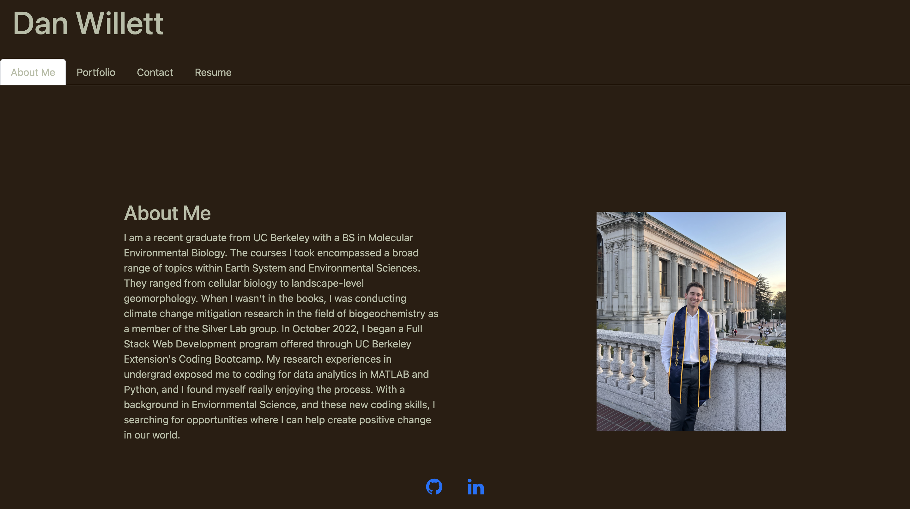

# react-portfolio

## Description

The motivation behind this project was to create a portfolio of works I've completed during my coding bootcamp and beyond. The goal is to showcase my work to potential employers and others looking to learn from my deployed applications. This is a single page application utilizing react components. This helps optimize application speed.

## Installation

No steps are required to intall this application. You just need to have a working web browser with access to internet. Navigate to the following link to access the portfolio: https://danwillett.github.io/react-portfolio/

## Usage

The website has four distinct pages, "About me", "Portfolio", "Contact", and "Resume". You can navigate to these pages using the navigation links at the top of the webpage. The "About me" section gives a brief introduction to who I am. The "Portfolio" section displays some of the projects I have completed. The "Contact" section provides a form that you can fill out and send to me if you would like to get in contact. The "Resume" page highlights some of my skills and provides a downloadable version of my resume. 

## Credits

- Github and LinkedIn icons by Font Awesome: https://fontawesome.com/
- Bootstrap styling: https://getbootstrap.com/
- React.js: https://react.dev/blog/2023/03/16/introducing-react-dev

## License
MIT license
